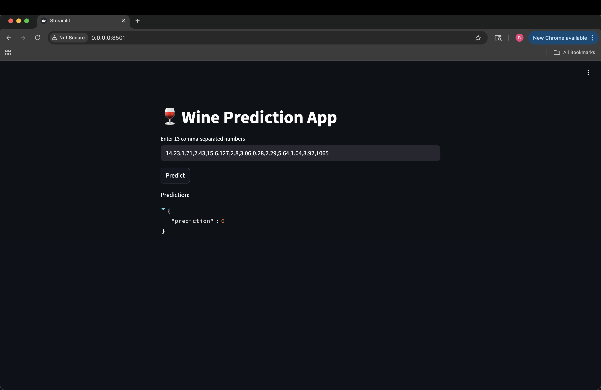

# 🍷 Wine Quality Prediction ML — FastAPI + Streamlit + Docker

This project deploys a **machine-learning wine prediction model** using:

- **FastAPI** → Backend API for predictions  
- **Streamlit** → Interactive UI for user input  
- **Docker Compose** → Runs both services together  
- **Scikit-learn** → Model training on the Wine dataset  

---

## Streamlit UI

---
## 📁 Project Structure
```
docker_lab/
│
├── docker-compose.yml
│
├── fastapi/
│ ├── Dockerfile
│ ├── main.py
│ ├── train.py
│ ├── requirements.txt
│ └── wine_model.pkl (generated during build)
│
└── streamlit/
├── Dockerfile
├── ui.py
└── requirements.txt
```

---

## How to Run

### 1️⃣ Build the containers

```
docker compose build --no-cache
```

### 2️⃣ Start the services
```
docker compose up
```
---

🌐 Access the Applications

Service	URL

- Streamlit UI	http://localhost:8501

- FastAPI API	http://localhost:8000
---
🛑 Stop Containers
```
docker compose down
